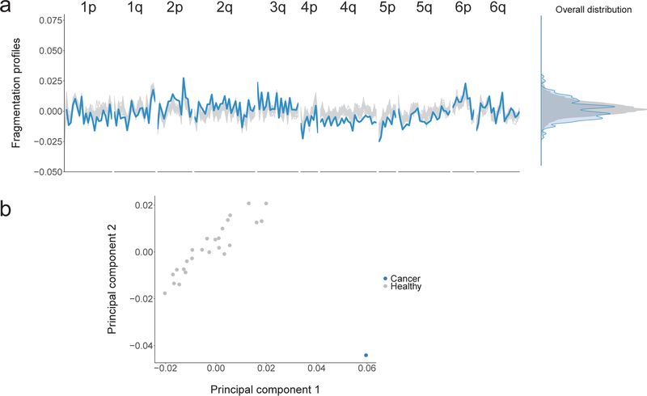

# DELFI

  
**Schematic of DELFI approach.** Blood is collected from healthy individuals and patients with cancer. cfDNA is extracted from plasma, processed into sequencing libraries, examined through WGS, mapped to the genome, and analyzed to determine cfDNA fragmentation profiles across the genome. Machine learning is used to categorize whether individuals have cancer and identify tumor tissue of origin.

  
**Aberrant cfDNA fragmentation profiles in patients with cancer.**
- (a) Genome-wide cfDNA fragmentation profiles (defined as the ratio of short to long fragments) from ~9x WGS are shown in 5 Mb bins for 30 healthy individuals (top) and 8 lung cancer patients (bottom).
- (b) Analyses of healthy cfDNA (top), lung cancer cfDNA (middle), and healthy lymphocyte (bottom) fragmentation profiles from chromosome 1 at 1 Mb resolution. Healthy lymphocyte profiles were scaled with a standard deviation equal to that of the median healthy cfDNA profiles.
- (c) Smoothed median distances between adjacent nucleosome centered at zero using 100 kb bins from healthy cfDNA (top) and nuclease-digested healthy lymphocytes (middle) are depicted together with the first eigenvector for the genome contact matrix from Hi-C analyses of lymphoblastoid cells (bottom).

  
**cfDNA fragmentation profiles in healthy individuals and patients with cancer.**
- (a) Fragmentation profiles (bottom) in the context of tumor copy number changes (top) in a colorectal cancer patient. The distribution of segment means and integer copy numbers are shown at top right.
- (b) GC adjusted fragmentation profiles from 1–2x WGS for healthy individuals and patients with cancer are depicted per cancer type using 5 Mb windows. The median healthy profile is indicated in black and the 98% confidence band is shown in gray. For patients with cancer, individual profiles are colored based on their Pearson correlation to the healthy median.
- (c) Windows are indicated in orange if more than 10% of the cancer samples had a fragment ratio more than three standard deviations from the median healthy fragment ratio.

  
**Detection of cancer using DELFI.** Receiver operator characteristics for detection of cancer using cfDNA fragmentation profiles and other genome-wide features in a machine learning approach are depicted for a cohort of 215 healthy individuals and 208 patients with cancer (DELFI, AUC = 0.94), with ≥ 95% specificity shaded in blue. Machine learning analyses of chromosomal arm copy number (Chr copy number (ML)), and mitochondrial genome copy number analyses (mtDNA), are shown in the indicated colors.

  
**Simulations of noninvasive cancer detection based on number of alterations analyzed and tumor-derived cfDNA fragment distributions.**
- (a) Monte Carlo simulations were performed using different numbers of tumor-specific alterations to evaluate the probability of detecting cancer alterations in cfDNA at the indicated fraction of tumor-derived molecules. The simulations were performed assuming an average of 2000 genome equivalents of cfDNA and the requirement of five or more observations of any alteration. These analyses indicate that increasing the number of tumor-specific alterations improves the sensitivity of detection of circulating tumor DNA.
- (b) Cumulative density functions of cfDNA fragment lengths of 42 loci containing tumor-specific alterations from 30 patients with breast, colorectal, lung, or ovarian cancer are shown with 95% confidence bands (orange). Lengths of mutant cfDNA fragments were significantly different in size compared to wild-type cfDNA fragments (blue) at these loci.
- (c) GC content was similar for mutated and non-mutated fragments.
- (d) GC content was not correlated to fragment length.

  
**Germline and hematopoietic cfDNA fragment distributions.**
- (a) Cumulative density functions of fragment lengths at 44 loci containing germline alterations (non-tumor derived) from 38 patients with breast, colorectal, lung, or ovarian cancer are shown with 95% confidence bands. Fragments with germline mutations (orange) were comparable in length to wild-type cfDNA fragment lengths (blue).
- (b) Cumulative density functions of fragment lengths at 41 loci containing hematopoietic alterations (non-tumor derived) from 28 patients with breast, colorectal, lung, or ovarian cancer are shown with 95% confidence bands. After correction for multiple testing, there were no significant differences (α=0.05) in the size distributions of mutated hematopoietic cfDNA fragments (orange) and wild-type cfDNA fragments (blue).

  
**cfDNA fragmentation in healthy individuals and patients with lung cancer.**
- (a) cfDNA fragments lengths are shown for healthy individuals (n=30, gray) and patients with lung cancer (n=8, blue).
- (b-d) cfDNA fragmentation profiles from healthy individuals (n=30) had high correlations while patients with lung cancer (n=8) had lower correlations to median fragmentation profiles of
  - (b) lymphocytes;
  - (c) lymphocyte nucleosome distances;
  - (d) healthy cfDNA.  
  Pearson correlations are shown with box plots depicting minimum, 25th percentile, median, 75th percentile, and maximum values.
- (e) High coverage (9x) whole-genome sequencing data were subsampled to 2x, 1x, 0.5x, 0.2x, and 0.1x fold coverage. Mean centered genome-wide fragmentation profiles in 5 Mb bins for 30 healthy individuals and 8 patients with lung cancer are depicted for each subsampled fold coverage with median profiles shown in blue.
- (f) Pearson Correlation of subsampled profiles to initial profile at 9x coverage for healthy individuals and patients with lung cancer.

  
**cfDNA fragmentation profiles and sequence alterations during therapy.** Detection and monitoring of cancer in serial blood draws from NSCLC patients (n=19) undergoing treatment with targeted tyrosine kinase inhibitors (black arrows) was performed using targeted sequencing (top) as previously reported and genome-wide fragmentation profiles (bottom). For each case, the vertical axis of the lower panel displays −1 times the Pearson correlation of each sample to the median healthy cfDNA fragmentation profile. Error bars depict confidence intervals from binomial tests for mutant allele fractions and confidence intervals calculated using Fisher transformation for genome-wide fragmentation profiles. Although the approaches analyze different aspects of cfDNA (whole genome compared to specific alterations) the targeted sequencing and fragmentation profiles were similar for patients responding to therapy as well as those with stable or progressive disease. As fragmentation profiles reflect both genomic and epigenomic alterations, while mutant allele fractions only reflect individual mutations, mutant allele fractions alone may not reflect the absolute level of correlation of fragmentation profiles to healthy individuals.

  
**Profiles of cfDNA fragment lengths in copy neutral regions in healthy individuals and one patient with colorectal cancer.**
- (a) The fragmentation profile in 211 copy neutral windows in chromosomes 1–6 for 25 randomly selected healthy individuals (gray). For a patient with colorectal cancer (CGCRC291) with an estimated mutant allele fraction of 20%, we diluted the cancer fragment length profile to an approximate 10% tumor contribution (blue).
- (a, b) While the marginal densities of the fragment profiles for the healthy samples and cancer patient show substantial overlap (a, right), the fragmentation profiles are different as can be seen visualization of the fragmentation profiles (a, left) and by the separation of the colorectal cancer patient from the healthy samples (n=25) in a principal component analysis (b).

  
**Genome-wide GC correction of cfDNA fragments.** To estimate and control for the effects of GC content on sequencing coverage, we calculated coverage in non-overlapping 100kb genomic windows across the autosomes. For each window, we calculated the average GC of the aligned fragments.
- (a) Loess smoothing of raw coverage (top row) for two randomly selected healthy subjects (CGPLH189 and CGPLH380) and two cancer patients (CGPLLU161 and CGPLBR24) with undetectable aneuploidy (PA score < 2.35). After subtracting the average coverage predicted by the loess model, the residuals were rescaled to the median autosomal coverage (bottom row). As fragment length may also result in coverage biases, we performed this GC correction procedure separately for short (≤ 150 bp) and long (> 150 bp) fragments. While the 100 kb bins on chromosome 19 (blue points) consistently have less coverage than predicted by the loess model, we did not implement a chromosome-specific correction as such an approach would remove the effects of chromosomal copy number on coverage.
- (b) Overall, we found a limited correlation between short or long fragment coverage and GC content after correction among healthy subjects (n=211, inter-quartile range: −0.03–0.03) and cancer patients (n=128, inter-quartile range: −0.06–0.02) with a PA score <3. Box plots depict minimum, 25th percentile, median, 75th percentile, and maximum values.

  
**Machine learning model.**
- (a) We used gradient tree boosting machine learning to examine whether cfDNA can be categorized as having characteristics of a cancer patient or healthy individual. The machine learning model included fragmentation size and coverage characteristics in windows throughout the genome, as well as chromosomal arm and mitochondrial DNA copy numbers. We employed a 10-fold cross-validation approach in which each sample is randomly assigned to a fold and 9 of the folds (90% of the data) are used for training and one fold (10% of the data) is used for testing. The prediction accuracy from a single cross-validation is an average over the 10 possible combinations of test and training sets. As this prediction accuracy can reflect bias from the initial randomization of patients, we repeat the entire procedure, including the randomization of patients to folds, 10 times. For all cases, feature selection and model estimation were performed on training data and were validated on test data and the test data were never used for feature selection. Ultimately, we obtained a DELFI score that could be used to classify individuals as likely healthy or having cancer.
- (b) Distribution of AUCs across the repeated 10-fold cross-validation. The 25th, 50th, and 75th percentiles of the 100 AUCs for the cohort of 215 healthy individuals and 208 patients with cancer are indicated by dashed lines.

  
**Whole-genome analyses of chromosomal arm copy number changes and mitochondrial genome representation.**
- (a) Z scores for each autosome arm are depicted for healthy individuals (n=215) and patients with cancer (n=208). The vertical axis depicts normal copy at zero with positive and negative values indicating arm gains and losses, respectively. Z scores greater than 50 or less than −50 are thresholded at the indicated values.
- (b) The fraction of reads mapping to the mitochondrial genome is depicted for healthy individuals (n=215) and patients with cancer (n=208). Box plots depict the minimum, 25th percentile, median, 75th percentile, and maximum values.

  
**DELFI detection of cancer and tissue of origin prediction.**
- (a) Analyses of individual cancer types using the DELFI-combined approach had AUCs ranging from 0.86 to >0.99.
- (b) Receiver operator characteristics for detection of cancer using cfDNA fragmentation profiles and other genome-wide features in a machine learning approach are depicted for a cohort of 215 healthy individuals and each stage of 208 patients with cancer with ≥ 95% specificity shaded in blue.
- (c) Receiver operator characteristics for DELFI tissue prediction of bile duct, breast, colorectal, gastric, lung, ovarian, or pancreatic cancer are depicted. In order to increase sample sizes within cancer type classes, we included cases detected with a 90% specificity, and the lung cancer cohort was supplemented with the addition of baseline cfDNA data from 18 lung cancer patients with prior treatment.
- (d) DELFI tissue of origin prediction.

  
**Detection of cancer using DELFI and mutation-based cfDNA approaches.** DELFI (green) and targeted sequencing for mutation identification (blue) were performed independently in a cohort of 126 patients with breast, bile duct, colorectal, gastric, lung, or ovarian cancer. The number of individuals detected by each approach and in combination are indicated for DELFI detection with a specificity of 98%, targeted sequencing specificity at >99%, and a combined specificity of 98%. ND indicates not detected.
